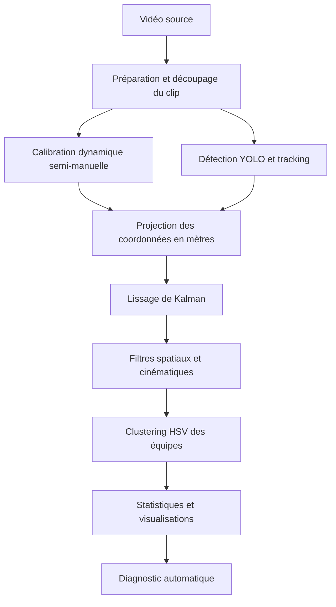

# Pipeline d’analyse vidéo de football amateur

**Notebook principal :** `TB_2026_Football_Analytics_Pipeline.ipynb`
**Version :** `v1.0-final`

## 1. Présentation générale

Ce projet implémente un pipeline d’analyse vidéo appliqué au football amateur. À partir d’une vidéo mono-caméra, le notebook permet :

* de détecter les personnes présentes sur le terrain ;
* de suivre les détections dans le temps ;
* de projeter les positions depuis l’image vers un terrain 2D exprimé en mètres ;
* de lisser les trajectoires ;
* de filtrer certaines valeurs cinématiques aberrantes ;
* de répartir automatiquement les pistes dans deux groupes d’équipe ;
* de produire des statistiques, des visualisations et un diagnostic de qualité ;
* de comparer plusieurs combinaisons de détecteurs et de trackers.

L’objectif est d’évaluer la faisabilité d’une solution de Football Analytics à faible coût, reposant principalement sur des outils open source et des ressources de calcul accessibles.

## 2. Architecture générale



## 3. Environnement recommandé

### Exécution Cloud

* Google Colab ;
* GPU NVIDIA Tesla T4 ou équivalent ;
* Python ;
* PyTorch avec support CUDA.

### Exécution locale testée

* processeur Intel Core i7-1185G7 ;
* 32 Go de mémoire vive ;
* Windows 11 ;
* exécution PyTorch sur CPU, sans accélération CUDA.

L’utilisation d’un GPU est fortement recommandée. L’exécution locale sur CPU reste possible, mais les temps de traitement sont nettement plus élevés.

## 4. Dépendances

Le notebook installe notamment les bibliothèques suivantes :

* `yt-dlp` ;
* `ultralytics` ;
* `supervision` ;
* `opencv-python` ;
* `matplotlib` ;
* `seaborn` ;
* `pandas` ;
* `numpy` ;
* `scikit-learn` ;
* `filterpy` ;
* `deep-sort-realtime` ;
* `lap>=0.5.12`.

FFmpeg doit également être disponible pour le découpage et la conversion des vidéos. Il est préinstallé dans Google Colab.

## 5. Utilisation rapide

1. Ouvrir `TB_2026_Football_Analytics_Pipeline.ipynb` dans Google Colab.
2. Sélectionner un environnement d’exécution avec GPU.
3. Exécuter les cellules dans l’ordre.
4. Fournir une vidéo locale au format MP4 ou configurer une URL compatible.
5. Vérifier les points de calibration lorsque le fallback manuel est utilisé.
6. Récupérer les fichiers générés dans le dossier :

```text
resultats/
```

Les fichiers d’authentification tels que `cookies.txt` ne doivent jamais être publiés dans le dépôt GitHub.

## 6. Description des principales étapes

### 6.1 Préparation de la vidéo

Le notebook peut utiliser un fichier vidéo déjà disponible ou tenter de télécharger et de découper une séquence avec `yt-dlp` et FFmpeg.

### 6.2 Calibration et homographie

Des images clés sont extraites de la vidéo afin d’identifier les lignes et les intersections visibles du terrain.

La configuration de référence utilise une calibration dynamique semi-manuelle :

* 12 images clés sont prévues ;
* 5 images clés disposent de points suffisants pour le calcul d’une homographie ;
* les positions projetées sont interpolées entre les homographies disponibles.

Les résultats doivent donc être interprétés avec prudence lorsque la caméra se déplace entre deux images calibrées.

### 6.3 Détection et suivi

Le pipeline principal utilise :

* **YOLOv8m** pour la détection des personnes ;
* **ByteTrack** pour l’association temporelle des détections.

Les identifiants générés sont des identifiants de suivi. Ils ne correspondent pas nécessairement à des joueurs uniques, car un même joueur peut recevoir plusieurs identifiants après une occlusion ou une perte de détection.

### 6.4 Projection et filtre de Kalman

Les coordonnées en pixels sont projetées sur un terrain de 105 × 68 mètres.

Un filtre de Kalman est appliqué à chaque piste afin de réduire les oscillations des positions. Les distances, vitesses et accélérations sont ensuite recalculées à partir des coordonnées lissées.

### 6.5 Validation spatiale et cinématique

Les mesures sont contrôlées selon plusieurs critères :

* position comprise dans les limites du terrain ;
* vitesse maximale fixée à 36 km/h ;
* accélération maximale fixée à 6 m/s² ;
* interruption maximale autorisée entre deux observations d’une même piste.

Les valeurs rejetées sont conservées dans les colonnes brutes, tandis que les statistiques finales utilisent les mesures filtrées.

### 6.6 Classification des équipes

La couleur dominante est extraite dans la zone du torse de chaque détection. Un masque HSV retire une partie des pixels correspondant à la pelouse.

K-Means avec `k = 2` répartit ensuite les pistes dans deux groupes :

* Équipe A ;
* Équipe B.

Les clusters sont stabilisés selon leur saturation moyenne afin de conserver une attribution cohérente entre les exécutions.

Cette étape mesure une affectation à deux groupes colorimétriques. Elle ne garantit pas que tous les joueurs, arbitres ou autres personnes soient correctement identifiés.

### 6.7 Statistiques et visualisations

Le pipeline génère notamment :

* des cartes de chaleur par équipe ;
* une distribution des vitesses ;
* les distances cumulées des pistes les plus longtemps observées ;
* le profil de vitesse des trois pistes les plus longtemps observées ;
* la trajectoire de la piste principale ;
* des visualisations combinant la vidéo originale et la projection 2D ;
* une vidéo annotée avec les boîtes de détection et les identifiants.

### 6.8 Benchmark

Les configurations suivantes sont comparées :

* YOLOv5u + ByteTrack ;
* YOLOv8n + ByteTrack ;
* YOLOv8m + ByteTrack ;
* YOLOv5u + DeepSORT ;
* YOLOv8n + DeepSORT ;
* YOLOv8m + DeepSORT.

Les indicateurs mesurés sont :

* le nombre de détections ;
* le nombre d’instances disposant d’un identifiant ;
* le nombre d’identifiants uniques créés ;
* le temps de traitement ;
* le débit en images par seconde.

## 7. Fichiers générés

| Fichier                                      | Description                                                   |
| -------------------------------------------- | ------------------------------------------------------------- |
| `resultats_bruts_tracking.csv`             | Détections et coordonnées en pixels                         |
| `resultats_metres_kalman.csv`              | Coordonnées projetées, lissées et métriques cinématiques |
| `stats_joueurs.csv`                        | Statistiques par identifiant de suivi                         |
| `stats_equipes.csv`                        | Statistiques agrégées par cluster d’équipe                |
| `validation_calibration.csv`               | Résultats détaillés de la validation Leave-One-Out         |
| `benchmark.csv`                            | Résultats du benchmark des détecteurs et trackers           |
| `qualite_tracking.csv`                     | Interruptions internes et durée des pistes                   |
| `synthese_resultats.json`                  | Synthèse et diagnostic automatique                           |
| `video_annotee_tracking.mp4`               | Vidéo annotée avec boîtes et identifiants                  |
| `visualisations/analyse_complete.png`      | Heatmaps, profils de vitesse et trajectoire principale        |
| `visualisations/distribution_vitesses.png` | Distribution des vitesses par équipe                         |
| `visualisations/distances_joueurs.png`     | Distances des 20 pistes les plus longtemps observées         |
| `visualisations/benchmark_fps.png`         | Comparaison des débits de traitement                         |
| `visualisations/keyframes_calibration.png` | Images utilisées pour la calibration                         |
| `visualisations/tracking_viz_frame_*.png`  | Visualisations vidéo et terrain 2D                           |

Certaines visualisations sont également exportées au format SVG.

## 8. Résultats de l’exécution de référence

L’exécution de référence a été réalisée dans Google Colab avec un GPU NVIDIA Tesla T4.

| Configuration       | Détections | Instances avec ID | Identifiants uniques |   Temps |   FPS |
| ------------------- | ----------: | ----------------: | -------------------: | ------: | ----: |
| YOLOv5u + ByteTrack |       3 615 |             3 615 |                   78 |  5,91 s | 50,74 |
| YOLOv8n + ByteTrack |       3 264 |             3 264 |                   88 |  6,75 s | 44,47 |
| YOLOv8m + ByteTrack |       3 961 |             3 961 |                   90 |  7,00 s | 42,83 |
| YOLOv5u + DeepSORT  |       4 225 |             3 842 |                   46 | 75,60 s |  3,97 |
| YOLOv8n + DeepSORT  |       4 005 |             3 578 |                   49 | 42,95 s |  6,98 |
| YOLOv8m + DeepSORT  |       4 708 |             4 245 |                   49 | 47,48 s |  6,32 |

La configuration YOLOv8m + ByteTrack est retenue comme compromis entre sensibilité de détection et efficacité computationnelle.

Les temps d’exécution peuvent varier selon l’instance Cloud attribuée par Google Colab.

## 9. Résultats de validation

* RMSE Leave-One-Out : **4,39 m** ;
* MAE Leave-One-Out : **2,36 m** ;
* positions projetées dans les limites du terrain : **80,95 %** ;
* observations disposant d’une vitesse valide : **28,09 %** ;
* vitesses candidates rejetées par les filtres : **64,78 %** ;
* diagnostic automatique final :  **non validé** .

Pour la piste de suivi 499 :

* durée d’observation : **39,93 s** ;
* distance cumulée filtrée : **57,13 m** ;
* vitesse moyenne instantanée : **12,44 km/h** ;
* vitesse maximale :  **35,95 km/h** .

## 10. Limites connues

Le pipeline constitue une preuve de concept et présente plusieurs limites :

* sensibilité aux mouvements de caméra et à la calibration ;
* calibration disponible sur seulement une partie des images clés ;
* ruptures et réattributions possibles des identifiants ;
* occlusions entre joueurs ;
* confusion possible entre joueurs, arbitres et autres personnes ;
* absence de suivi fiable du ballon ;
* forte proportion de mesures cinématiques rejetées ;
* classification des équipes non validée par une annotation manuelle ;
* dépendance aux plateformes vidéo et à leurs mécanismes d’accès ;
* variabilité des performances dans les environnements Cloud.

Les résultats produits doivent être interprétés comme des indicateurs exploratoires. Ils ne remplacent pas un système professionnel GPS, LPS ou multi-caméras.

## 11. Sécurité et publication

Ne pas publier dans le dépôt :

* les fichiers `cookies.txt` ;
* les identifiants ou jetons d’accès ;
* les vidéos soumises à des droits de diffusion ;
* les fichiers contenant inutilement des données personnelles ;
* les fichiers vidéo volumineux générés par le pipeline.
